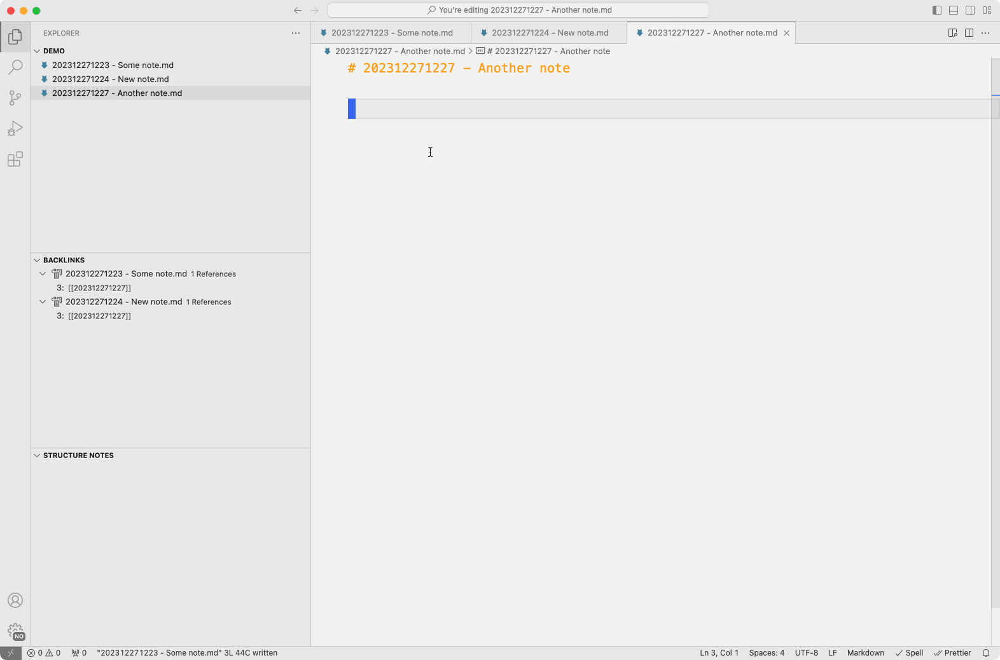
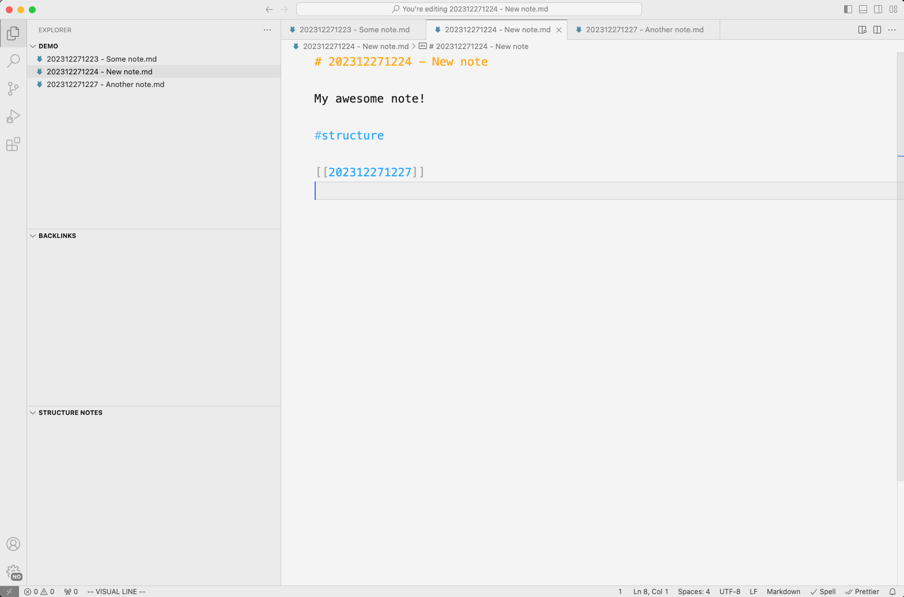
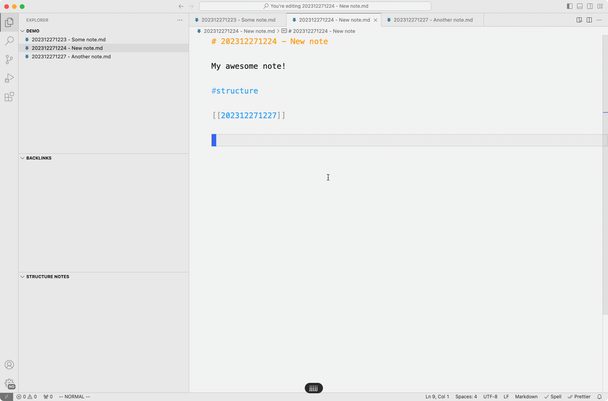
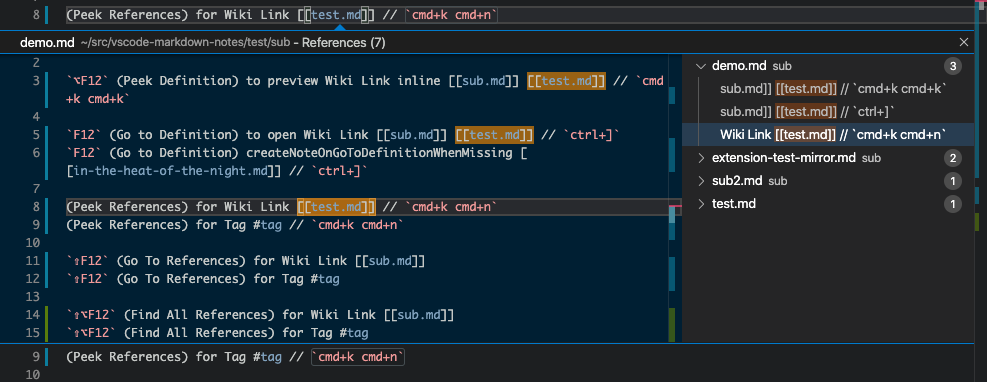
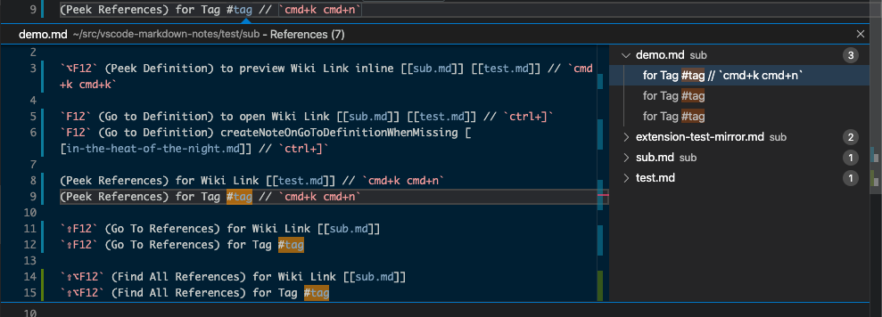
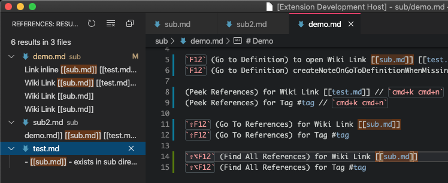
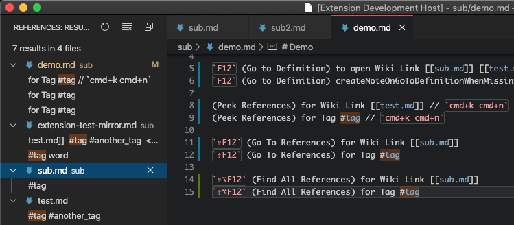
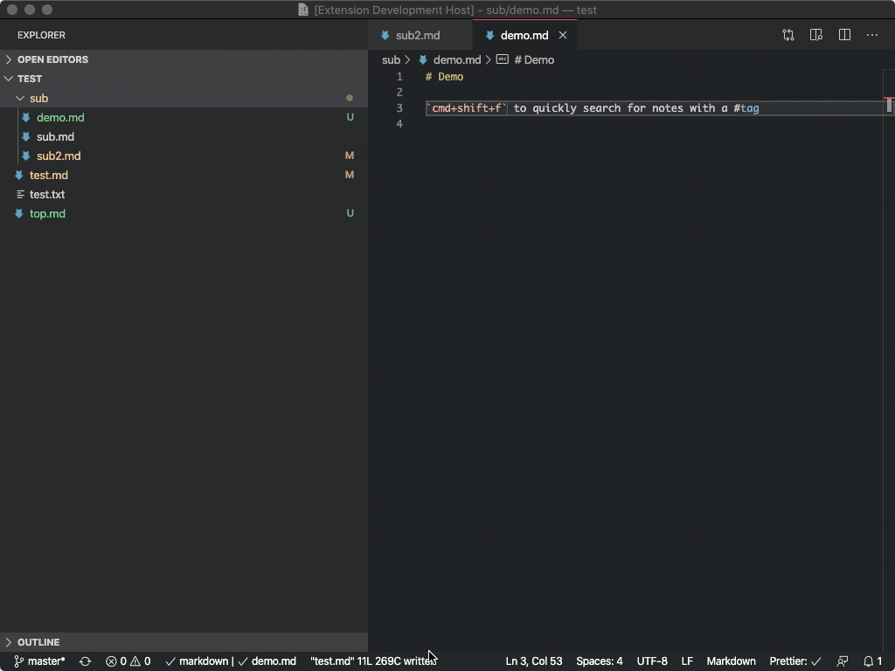

# Zettel Archive for VS Code

This package is based on the [Markdown Note (Zettelkasten Remix)](https://marketplace.visualstudio.com/items?itemName=maxedmands.vscode-zettel-markdown-notes) package, made to be a bit more compatible for Zettelkasten workflows most similar to The Archive. User settings and functionality have been reduced drastically from the original package.

Warning: I made this package primarily for myself since The Archive is only made available for MacOS and I wanted to use similar functionality on both Linux and Windows. Additionally, VSCode provides me with Vim keybidings which I love.

Features:

- Use `[[wiki-links]]` and `backlinks` for fast-navigation of markdown notes
- Wiki-links will show as `[[zettel-id]]` and resolve to file name `zettel-id - whatever note title.md`
- Syntax highlighting for `[[wiki-links]]` and `#tags`
- Autocomplete to any files in the directory when you start typing a `[[zettel-id]]`
- Add timestamp-based IDs before all new files that get generated
- Generate new IDs with a command (`vscodeZettelArchive.newNote`)

[Install from the VSCode Marketplace](https://marketplace.visualstudio.com/items?itemName=maxedmands.vscode-zettel-markdown-notes).

### Screenshots

### Backlinks Explorer Panel



#### Syntax Highlighting for Tags and Wiki Links



#### Peek and Go to Definition for Wiki Links



#### Peek References to Wiki Links



#### Peek References to Tag



#### Find All References to Wiki Links



#### Find All References to Tag



#### `cmd+shift+f` to Search Workspace for Notes with Tag



## dev

Run `npm install` first.

### TODO

- Add tests
- Add screenshots

### Development and Release

#### Test

Shamefully no tests yet. On the todo list.

#### Release

To create a new release,

```sh
npm install
# bump version number in package.json
npm run vpackage # package the release, creates vsix
npm run vpublish # publish to store, see https://code.visualstudio.com/api/working-with-extensions/publishing-extension
# Will prompt for Azure Devops Personal Access Token, get fresh one at:
# https://dev.azure.com/andrewkortina/
# On "Error: Failed Request: Unauthorized(401)"
# see: https://github.com/Microsoft/vscode-vsce/issues/11
# The reason for returning 401 was that I didn't set the Accounts setting to all accessible accounts.
```

To install the `vsix` locally:

1. Select Extensions `(Ctrl + Shift + X)`
2. Open `More Action` menu (ellipsis on the top) and click `Install from VSIX…`
3. Locate VSIX file and select.
4. Reload VSCode.

###### Helpful Links

- completion: https://github.com/microsoft/vscode-extension-samples/blob/master/completions-sample/src/extension.ts
- syntax: https://flight-manual.atom.io/hacking-atom/sections/creating-a-legacy-textmate-grammar/
- vscode syntax: https://code.visualstudio.com/api/language-extensions/syntax-highlight-guide
